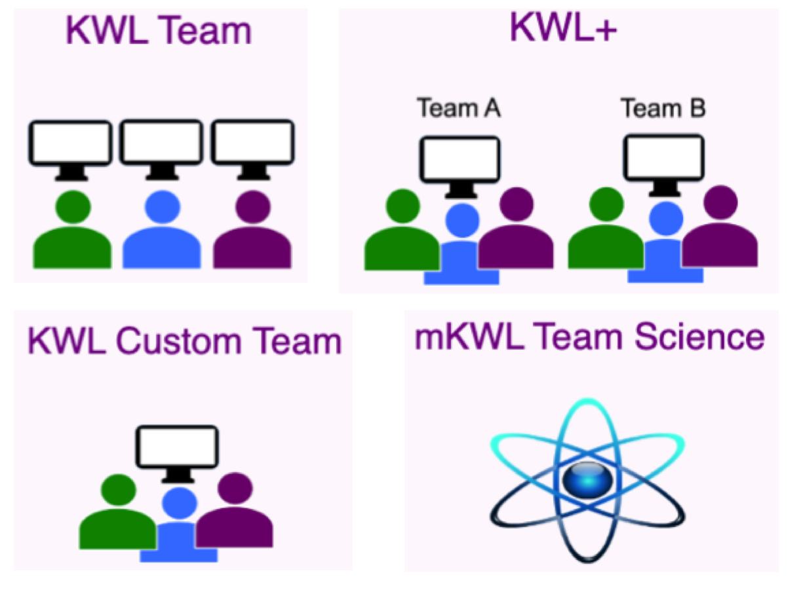

# KWL (Know What Learn) Application

This prototype is intended to provide teachers with a KWL support tool, which accommodates class sizes typically between twenty-five and thirty students. In order to reflect the number of students in such a class, and provide a realistic representation of an e-learning environment, a total of twelve students were created and divided into four separate teams. The usernames, team names and passwords for each student are given in the table below.

[Application Link](http://kwsapp-env.hvxtdpw5gr.us-east-2.elasticbeanstalk.com/htdocs/login.php)

