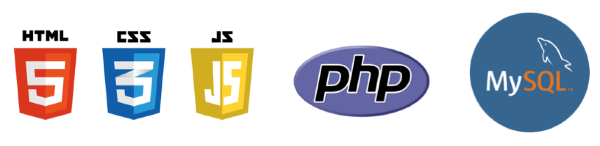

# KWL (Know What Learn) Application

[Visit KWL application](http://kwsapp-env.hvxtdpw5gr.us-east-2.elasticbeanstalk.com/htdocs/login.php)

This prototype is intended to provide secondary school teachers with a KWL support tool, which accommodates class sizes typically between twenty-five and thirty students. In order to reflect the number of students in such a class, and provide a realistic representation of an e-learning environment, a total of twelve students were created and divided into four separate teams. The usernames, team names and passwords for each student are given in the table below.

|Username|Team |Password  |   |Username|Team |Password |
|---     |---  |---       |---|---     |---  |---      |
|Mike    |phi  |mike123   |   |Helen   |beta |helen123 |
|Claire  |phi  |claire123 |   |Sophie  |beta |sophie123|
|Sam     |phi  |sam123    |   |Leo     |beta |leo123   |
|Paul    |omega|paul123   |   |Lucas   |sigma|lucas123 |
|Zak     |omega|zak123    |   |Lara    |sigma|lara123  |
|Jack    |omega|jack123   |   |Mika    |sigma|mika123  |

