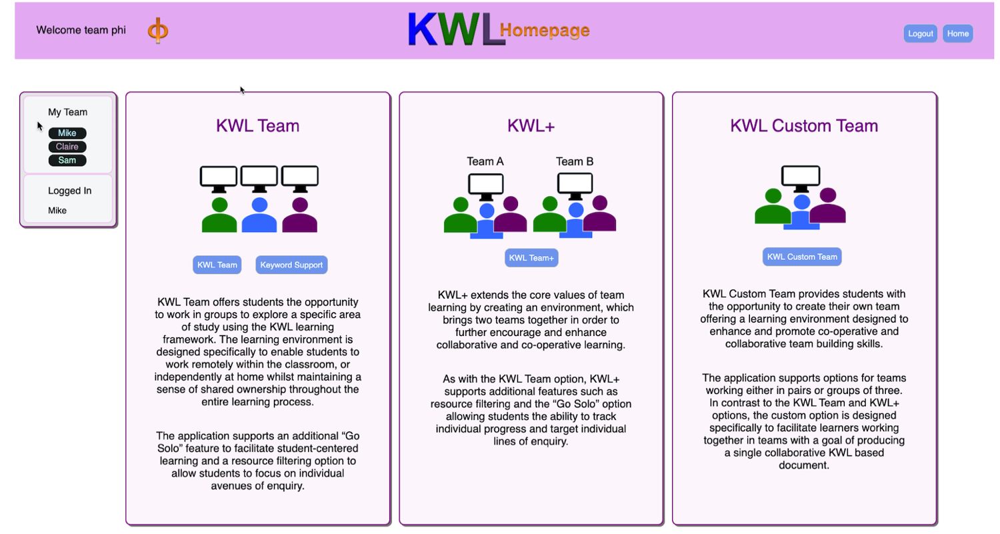
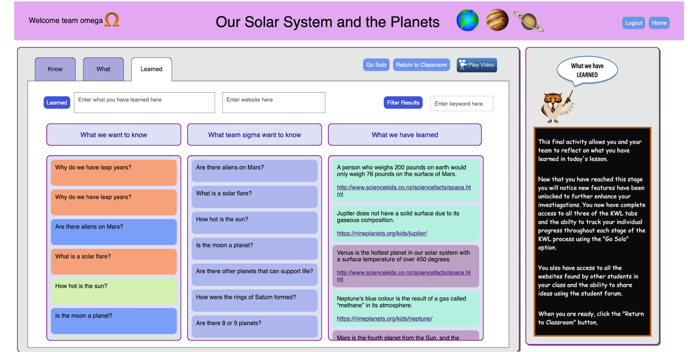
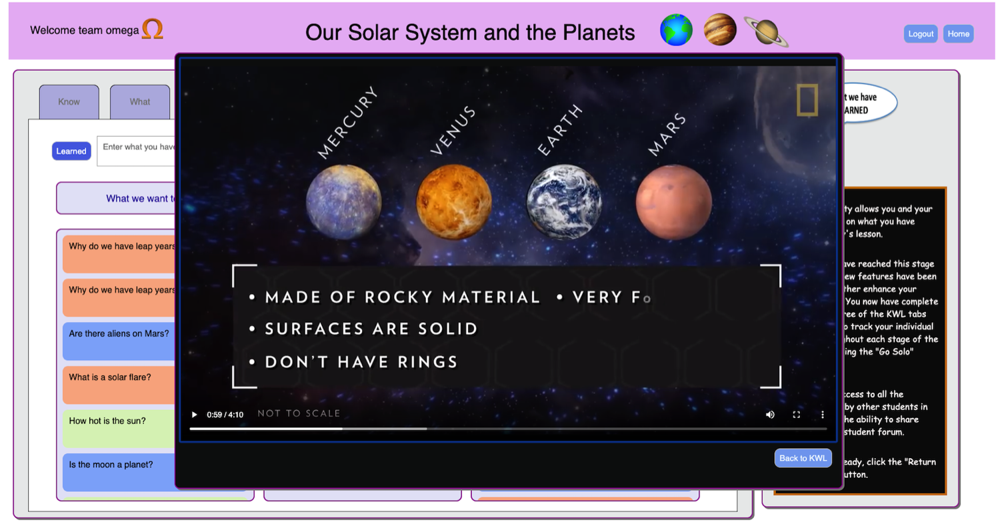

# Features
* Educational desktop application based on the KWL learning approach
* Allows students to work in pre assigned groups or to create their own custom groups
* Interactions can take place both face-to-face in the classroom, or remotely

# Screenshots

## Main Menu Screen

## KWL Team Demo

## Play Movie Option

